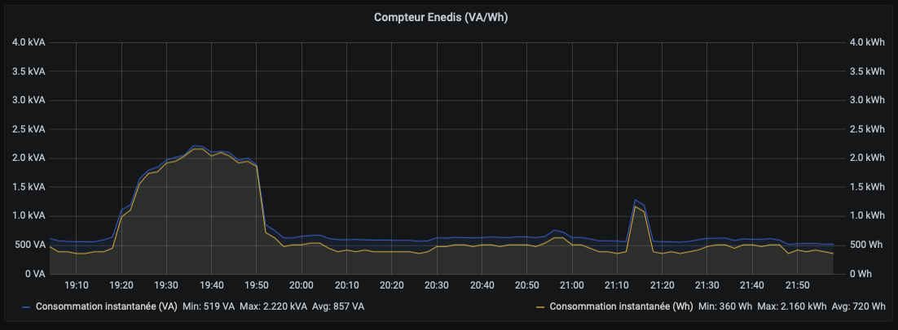

# teleinfometro
French Enedis Teleinfo exporter

This code read the stream data from any electronic power meter from Enedis (even the old ones) and send the power meter to an Influxdb database in order to be graphed with Grafana.

To allow a fast deployment, this code doesn't use the InfluxDB client lib. It uses instead the REST interface.

The code should work with Windows since python-serial library works with Windows.



# Install (the dark side)
- Install the stuff
```bash
apt update
apt install -y python3-serial python3-requests
curl -o /usr/local/bin/teleinfometro.py https://raw.githubusercontent.com/loiklo/teleinfometro/master/teleinfometro.py
chmod +x /usr/local/bin/teleinfometro.py
```

- Create the Influxdb database
```bash
curl -i -XPOST http://influxdb.lan:8086/query --data-urlencode "q=CREATE DATABASE teleinfometro"
```

- Configure the script
```python
cfg_serial_port   = '/dev/ttyUSB0'
cfg_influxdb_host = 'http://influxdb.lan:8086/write?db=teleinfometro'
cfg_location      = 'myhouse'
```

- Add the systemd script and start the service
```bash
cat > /etc/systemd/system/teleinfometro.service <<EOF
[Unit]
  Description=teleinfometro
  After=time-sync.target
[Service]
  User=root
  Group=root
  ExecStart=/usr/local/bin/teleinfometro.py
  WorkingDirectory=/tmp
  Restart=on-failure
  RestartSec=10
[Install]
  WantedBy=multi-user.target
EOF

systemctl daemon-reload
systemctl enable teleinfometro
systemctl start teleinfometro
```

# Task List
- [x] Read stream from teleinfo serial port
- [x] Allow interval data aggregation to only send the average value to Influxdb
- [x] Send data to Influxdb
- [ ] Create routine/thread to send data at a user defined interval
- [x] Create a linux systemd daemon
- [ ] Move the configuration options to a configuration file
- [ ] Add the peak value with the average when pushing data to Influxdb
- [ ] Send the overall power consumption with a dedicated routine/thread
